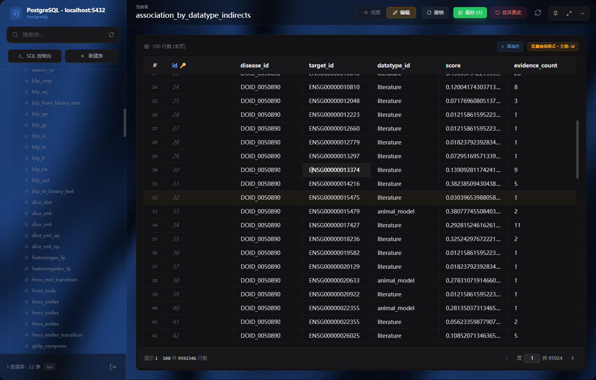
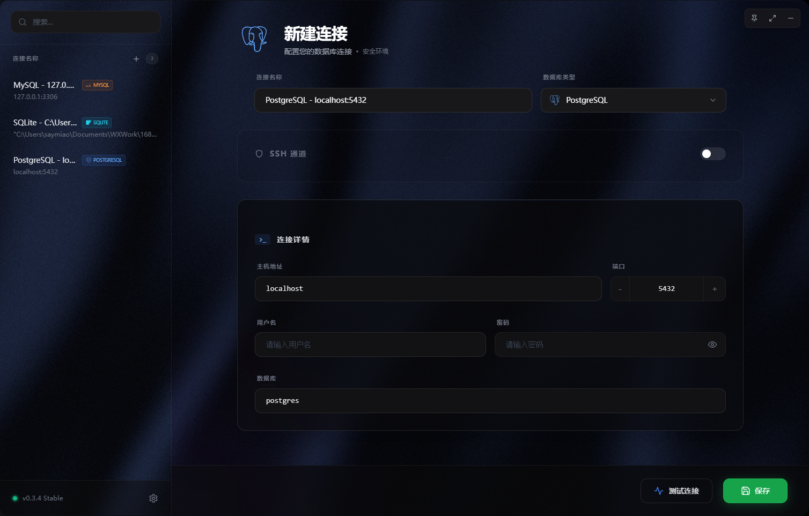

# Spectra Studio (光谱工坊)

<p align="center">
  
</p>

<p align="center">
  <strong>一款高性能、高颜值的数据库管理工具，专为追求设计的开发者打造。</strong>
</p>

<p align="center">
  
  
  
  
  
</p>

---

[English](./README.md) | [简体中文](./README_zh.md)

**Spectra Studio (光谱工坊)** 是一款现代化的数据库管理客户端，将极致的本地性能与高级的“玻璃拟态”（Glassmorphism）设计风格完美结合。它轻量、快速，为您提供跨多个数据库引擎的无缝管理体验。

## 📸 界面预览

|            新建连接            |          数据浏览          |
| :----------------------------: | :------------------------: |
|  |  |

## 📥 下载安装

获取适用于您平台的最新版本：

| 平台              | 下载链接                                                                                                                                        |
| :---------------- | :---------------------------------------------------------------------------------------------------------------------------------------------- |
| **Windows** (x64) | [**Spectra.Studio_0.3.4_x64-setup.exe**](https://github.com/dsxksss/spectra-studio/releases/download/v0.3.5/Spectra.Studio_0.3.5_x64-setup.exe) |
| **macOS / Linux** | 即将推出                                                                                                                                        |

> [!NOTE]
> 查看所有历史版本和更新日志，请访问 [Releases](https://github.com/dsxksss/spectra-studio/releases) 页面。

## ✨ 特性

### 🛠 支持的数据库

- **PostgreSQL**: 深度支持模式（Schema）、表、视图和函数管理。
- **MySQL**: 功能齐全的 MySQL 实例管理体验。
- **SQLite**: 本地文件管理，界面简洁直观。
- **Redis**: 专业的键值浏览器，支持 String、Hash、List 等多种数据结构。

### 🎨 卓越的设计与交互

- **玻璃拟态 UI**: 精致、现代的界面，具有通透的视觉深度。
- **动态主题**: 交互式“丝绸”背景动画和可自定义的配色方案。
- **数据库感知主题**: 根据连接的数据库类型自动调整应用主色调（例如 Postgres 蓝，MySQL 橙）。
- **微交互体验**: 基于 Framer Motion 和 Three.js 的流畅过渡和悬停效果。

### 🔐 安全与性能

- **SSH 隧道**: 内置对 SSH 加密通道的支持，安全连接远程数据库。
- **原生性能**: 使用 Rust (Tauri) 编译，资源占用低，响应极快。

### 📊 高级管理功能

- **智能数据网格**: 交互式表浏览器，支持批量编辑、搜索和过滤。
- **SQL 控制台**: 强大的编辑器，支持运行自定义查询并实时查看结果。
- **国际化**: 全面支持中英文语言切换。

## 🚀 快速开始

### 开发环境准备

- [Node.js](https://nodejs.org/) (v18+)
- [Rust](https://www.rust-lang.org/) (v1.75+)
- [pnpm](https://pnpm.io/) (推荐)

### 安装步骤

1. **克隆仓库**

   ```bash
   git clone https://github.com/dsxksss/spectra-studio.git
   cd spectra-studio
   ```

2. **安装依赖**

   ```bash
   pnpm install
   ```

3. **运行开发模式**

   ```bash
   pnpm tauri dev
   ```

4. **构建发行版**
   ```bash
   pnpm tauri build
   ```

## 🛠 技术栈

- **前端**: [React](https://react.dev/), [Vite](https://vitejs.dev/)
- **后端**: [Tauri 2.0](https://v2.tauri.app/) (Rust)
- **样式**: [Tailwind CSS](https://tailwindcss.com/)
- **动画**: [Framer Motion](https://www.framer.com/motion/), [Three.js](https://threejs.org/)
- **图标**: [HugeIcons](https://hugeicons.com/), [Lucide](https://lucide.dev/)

## 📄 开源协议

本项目基于 MIT 协议开源 - 详情请参阅 [LICENSE](LICENSE) 文件。

---
